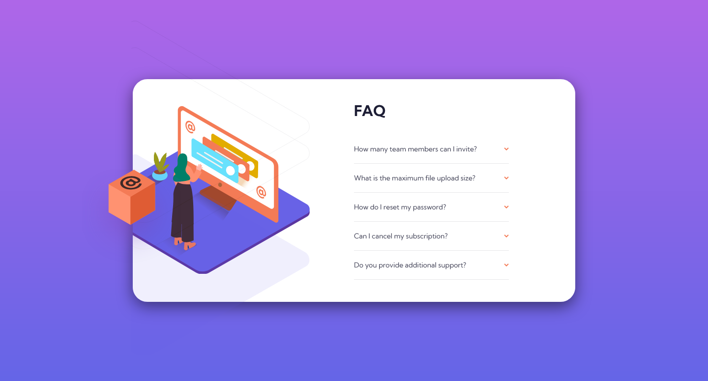
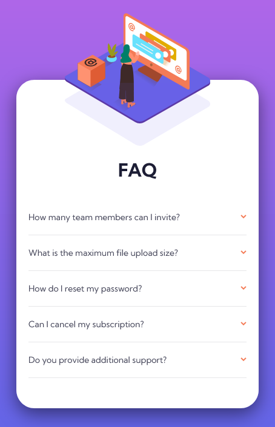

# Frontend Mentor - FAQ accordion card solution

This is a solution to the [FAQ accordion card challenge on Frontend Mentor](https://www.frontendmentor.io/challenges/faq-accordion-card-XlyjD0Oam). Frontend Mentor challenges help you improve your coding skills by building realistic projects. 

## Table of contents

- [Overview](#overview)
  - [The challenge](#the-challenge)
  - [Screenshot](#screenshot)
  - [Links](#links)
- [My process](#my-process)
  - [Built with](#built-with)
  - [What I learned](#what-i-learned)

## Overview

### The challenge

Users should be able to:

- View the optimal layout for the component depending on their device's screen size
- See hover states for all interactive elements on the page
- Hide/Show the answer to a question when the question is clicked

### Screenshot




### Links

- Solution URL: [Add solution URL here](https://github.com/wanghm0227/Frontend-Challenges/tree/main/faq-accordion-card-main)
- Live Site URL: [Add live site URL here](https://wanghm0227.github.io/Frontend-Challenges/faq-accordion-card-main/index.html)

## My process

### Built with

- Semantic HTML5 markup
- CSS custom properties
- Flexbox
- Mobile-first workflow


### What I learned

```html
<picture>
  <source media="(min-width:900px)" srcset="images/illustration-woman-online-desktop.svg">
  
</picture>
```
```css
.accordion__body {
  max-height: 0;
  overflow: hidden;
  opacity: 0;
  transition: all .5s;
}
.accordion__item.active .accordion__body {
  max-height: 10em;
  opacity: 1;
}
.card__img .img-woman {
    clip-path: inset(0 0 0 20%);
  }
```
```js
this.parentElement.classList.toggle('active');
```
